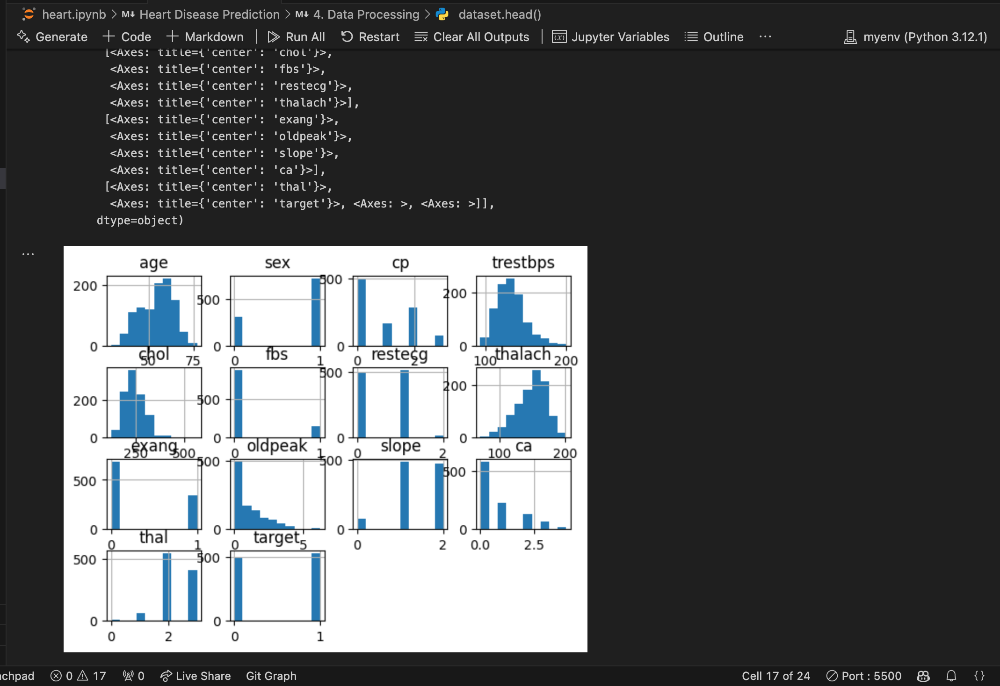

# Heart Disease Prediction with HeartAI

HeartAI is a machine learning project that predicts heart disease risk based on patient clinical and personal data. The project encompasses data analysis, model training, evaluation, and a Flask web application for easy deployment. Our final model achieves an accuracy of **98.54%**.

---

## Table of Contents

- [Overview](#overview)
- [Data Analysis](#data-analysis)
- [Model Building](#model-building)
- [Model Evaluation](#model-evaluation)
- [Flask Web Application](#flask-web-application)
- [Installation and Setup](#installation-and-setup)
- [Usage](#usage)
- [Media](#media)
- [Contributing](#contributing)
- [License](#license)
- [Contact](#contact)

---

## Overview

HeartAI leverages patient data—including age, gender, chest pain type, blood pressure, cholesterol levels, and other clinical measurements—to predict the risk of heart disease. The project is divided into the following parts:

1. **Data Analysis:** Cleaning, exploring, and visualizing the dataset.
2. **Model Building:** Preprocessing the data and training a machine learning model.
3. **Model Evaluation:** Assessing the model’s performance (accuracy: **98.54%**).
4. **Flask Web App:** Creating an interactive interface for users to input data and view predictions.

---

## Data Analysis

The dataset (`heart.csv`) contains 13 features:
- Age
- Sex
- Chest Pain Type
- Resting Blood Pressure
- Cholesterol
- Fasting Blood Sugar
- Resting ECG
- Maximum Heart Rate
- Exercise-Induced Angina
- ST Depression
- Slope of the Peak Exercise ST Segment
- Number of Major Vessels
- Thalassemia

We used **pandas** to load and clean the data and **seaborn** along with **matplotlib** to visualize the data distributions and correlations.

> **Example Visualization: Correlation Heatmap**  
> 

---

## Model Building

We preprocessed the data by scaling the numerical features and then split the dataset into training and test sets. A **Random Forest Classifier** was trained on the data.

### Sample Code for Model Training

```python
import pandas as pd
import numpy as np
from sklearn.model_selection import train_test_split
from sklearn.ensemble import RandomForestClassifier
from sklearn.metrics import accuracy_score
import joblib

# Load dataset
data = pd.read_csv('heart.csv')

# Data Preprocessing (e.g., scaling numerical features)
# (Include your preprocessing steps here)

# Splitting the data
X = data.drop(columns=['target'])
y = data['target']
X_train, X_test, y_train, y_test = train_test_split(X, y, test_size=0.2, random_state=42)

# Train the model
model = RandomForestClassifier(n_estimators=100, random_state=42)
model.fit(X_train, y_train)
y_pred = model.predict(X_test)

# Evaluate model accuracy
accuracy = accuracy_score(y_test, y_pred)
print(f"Model Accuracy: {accuracy * 100:.2f}%")  # Expected: 98.54%

# Save the model
joblib.dump(model, 'heart_disease_model.pkl')
```

---

## Model Evaluation

After training, our model achieved an accuracy of **98.54%**. We also evaluated it using a confusion matrix and classification report, confirming that the model reliably distinguishes between patients with and without heart disease.

> **Example: Confusion Matrix**  
> 

---

## Flask Web Application

The Flask app provides a user-friendly interface where users can input the required 13 clinical and personal measurements. When the model predicts "Heart Disease Detected," the interface automatically scrolls to the result panel and displays additional instructions—advising users to consult healthcare professionals and providing links to trusted resources.

### Key Features of the Flask App:

- **Interactive Form:** Collects all 13 measurements.
- **Dynamic Results:** Shows prediction results with color-coded feedback (red for high risk, green for low risk).
- **Autoscroll:** Automatically scrolls down so that the result panel is centered.
- **Resource Links:** Provides additional instructions and trusted websites (American Heart Association, CDC, Mayo Clinic, NHLBI) for further help.

## Installation and Setup

1. **Clone the repository:**

   ```bash
   git clone https://github.com/yourusername/heart-disease-prediction.git
   cd heart-disease-prediction
   ```

2. **Create and activate a virtual environment:**

   ```bash
   python -m venv venv
   source venv/bin/activate  # On Windows: venv\Scripts\activate
   ```

3. **Install dependencies:**

   ```bash
   pip install -r requirements.txt
   ```

4. **Place the dataset:**
   - Ensure `heart.csv` is in the project root.

5. **Train the Model:**

   ```bash
   python train_model.py
   ```

6. **Run the Flask App:**

   ```bash
   python app.py
   ```

7. **Open your browser:**
   - Navigate to `http://127.0.0.1:5000/`

---

## Usage

- **Input Data:**  
  Enter the required 13 clinical measurements and personal information into the form.

- **View Prediction:**  
  Click **Analyze Results**. If the model predicts "Heart Disease Detected," the result panel will automatically scroll into view and display additional instructions.

- **Follow-Up Instructions:**  
  If high risk is detected, the app will advise you to:
  - Consult a healthcare professional immediately.
  - Contact emergency services if experiencing severe symptoms.
  - Visit trusted resources for more information.

---

## Media

### Screenshots

- **Homepage and Form Interface:**
  

- **Data Analysis Visualization:**
  

- **Accuracy:**
  

### Videos Demo

Watch our video demonstration of the app in action:
[Watch the Video](assets/heart_fail.mov)

[Watch the Video](assets/heart_success.mov)

---

## Contributing

Contributions are welcome! Feel free to fork the repository and submit a pull request. Please follow our [Contribution Guidelines](CONTRIBUTING.md) when making changes.

---

## License

This project is licensed under the MIT License. See the [LICENSE](LICENSE) file for details.

---

## Contact

For questions, suggestions, or feedback, please reach out at [hkouiriti@gmail.com](mailto:hkouiriti@gmail.com).

---

*Thank you for checking out HeartAI! Stay heart-healthy and informed.*
